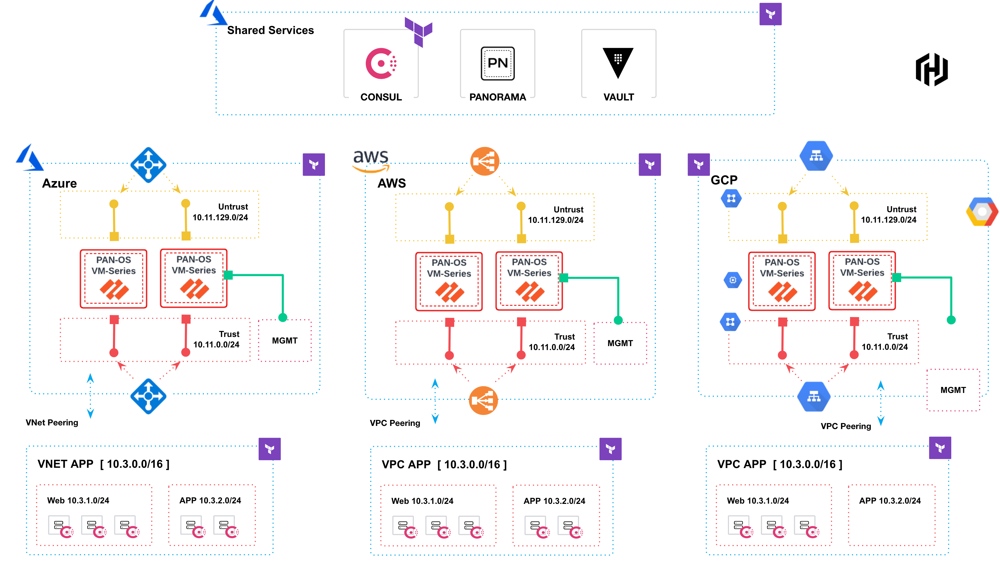

# Multi-Cloud-Security-Deployment with Consul Terraform Sync and Palo Alto-consul-palo-alto-nia

The following repo will demo the following:
* Build a multi-cloud environment in Azure, GCP and AWS
* Deploy Central Panorama to Manage multiple Palo Alto Firewalls
* Deploy HashiCorp Vault for secrets management/Identity Broker
* Deploy Consul with Consul Terraform Sync to Automate Network infrastructure
* Deploy Boundary to Provide Secure External Acceess to our Apps/FW/Services across the clouds
* Use Terraform to build out the infrastructure

The objective of the code/demo is to provide an example on how to deploy and manage security policies in a Zero Day world. As new apps and services get deployed, we want the Consul-Terraform-Sync to automtaically build a Terraform Manifest and update the policies on all our Palo Alto PAN-OS devices. 

More to come soon..

https://aws.amazon.com/marketplace/pp/prodview-mn63yjbq37n4c?sr=0-4&ref_=beagle&applicationId=AWSMPContessa